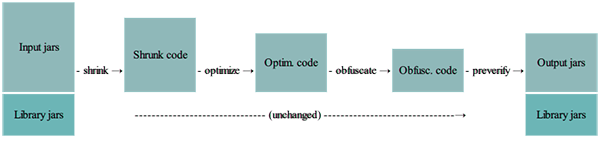

[官方链接](http://proguard.sourceforge.net/index.html#manual/usage.html)

### ProGuard简介
ProGuard是一个开源的Java类文件（.class）处理工具，相比起其它的Java混淆器，ProGuard更快，更易用。它同时提供了命令行和图形界面。ProGuard能够：

    1.压缩（Shrunk ）：检测未使用的类、字段、方法、属性，并移除
    2.优化（Optimization）：分析并优化方法的字节码，可以进行多步骤的优化
    3.混淆（Obfuscation ）：重命名类、字段、方法，使用更短且无意义的名字
    4.预校验（Preverification ）：为字节码添加预校验信息，预校验信息对Java 6+是需要的

上述功能可以单独使用，也可以在一次调用中按照下面的步骤一次性完成：

作为ProGuard输入的可以是jar、war、ear、zip、apk或者目录，经过最终处理后，输出到相应的压缩文件或者目录中。需要注意的是，输入文件可以包含资源文件，其名称和内容会被更新，以反映被混淆后的类名。
你需要为ProGuard指定库文件（lib jars），这些库用来编译被处理的那些类，这些库不会被改变。

### 入口点（Entry points）
为了判断哪些代码必须保留，那些可以被删除或者混淆，你需要为ProGuard指定“入口点”。入口点是一些类，它们通常是Main classes、methods、applets、activities，等等。ProGuard按如下规则使用入口点：

    - 在压缩阶段：从入口点开始，递归的判断哪些类、类成员被使用，所有其它的则被丢弃
    - 在优化阶段：非入口点函数或者方法，可能被设置为private、static、final、未使用的参数可能被移除，某些方法可能被内联
    - 在混淆阶段：非入口点类、类成员被重命名
    - 预校验阶段不需要知道入口点信息

### 参数：
- -include {filename}    从给定的文件中读取配置参数
- -basedirectory {directoryname}    指定基础目录为以后相对的档案名称
- -injars {class_path}    指定要处理的应用程序jar,war,ear和目录
- -outjars {class_path}    指定处理完后要输出的jar,war,ear和目录的名称
- -libraryjars {classpath}    指定要处理的应用程序jar,war,ear和目录所需要的程序库文件
- -dontskipnonpubliclibraryclasses    指定不去忽略非公共的库类。
- -dontskipnonpubliclibraryclassmembers    指定不去忽略包可见的库类的成员。

### 保留选项
- -keep {Modifier} {class_specification}    保护指定的类文件和类的成员
- -keepclassmembers {modifier} {class_specification}    保护指定类的成员，如果此类受到保护他们会保护的更好
- -keepclasseswithmembers {class_specification}    保护指定的类和类的成员，但条件是所有指定的类和类成员是要存在。
- -keepnames {class_specification}    保护指定的类和类的成员的名称（如果他们不会压缩步骤中删除）
- -keepclassmembernames {class_specification}    保护指定的类的成员的名称（如果他们不会压缩步骤中删除）
- -keepclasseswithmembernames {class_specification}    保护指定的类和类的成员的名称，如果所有指定的类成员出席（在压缩步骤之后）
- -printseeds {filename}    列出类和类的成员-keep选项的清单，标准输出到给定的文件

### 压缩
- -dontshrink    不压缩输入的类文件
- -printusage {filename}
- -whyareyoukeeping {class_specification}     

### 优化
- -dontoptimize    不优化输入的类文件
- -assumenosideeffects {class_specification}    优化时假设指定的方法，没有任何副作用
- -allowaccessmodification    优化时允许访问并修改有修饰符的类和类的成员
- -optimizationpasses int 优化级别

### 混淆
- -dontobfuscate    不混淆输入的类文件
- -printmapping {filename}
- -applymapping {filename}    重用映射增加混淆
- -obfuscationdictionary {filename}    使用给定文件中的关键字作为要混淆方法的名称
- -overloadaggressively    混淆时应用侵入式重载
- -useuniqueclassmembernames    确定统一的混淆类的成员名称来增加混淆
- -flattenpackagehierarchy {package_name}    重新包装所有重命名的包并放在给定的单一包中
- -repackageclass {package_name}    重新包装所有重命名的类文件中放在给定的单一包中
- -dontusemixedcaseclassnames    混淆时不会产生形形色色的类名
- -keepattributes {attribute_name,...}    保护给定的可选属性，例如LineNumberTable, LocalVariableTable, SourceFile, Deprecated, Synthetic, Signature, and InnerClasses.
- -renamesourcefileattribute {string}    设置源文件中给定的字符串常量
- -dontwarn 忽略某个具体警告

- [-keep 使用](keep使用)

### 生成文件
使用ProGuard之后，会生成4个文件（gradle构建的android项目在app/build/outputs/mapping/release下）
- dump.txt 描述apk文件中所有类文件间的内部结构。
- mapping.txt 列出了原始的类，方法，和字段名与混淆后代码之间的映射。
- seeds.txt 列出了未被混淆的类和成员
- usage.txt 列出了从apk中删除的代码

>tips:
-dump {file}
-printseeds {file}
-printmapping {file}
-printusage {file}
可以修改生成文件的路径和文件名

可以通过查看seeds.txt查看未被混淆的类或者成员

### ProGuard在Android项目中的使用
[ProGuard在Android项目中的使用](android_proguard.md)
